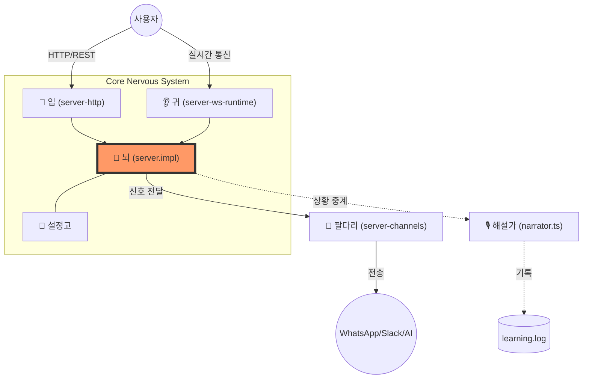

# 연재 4회: Gateway Server의 중추 신경망 구축 (The Nervous System)

> [!IMPORTANT]
> **핵심 목표**: 지난 시간의 환경 설정을 발판 삼아, OpenClaw 시스템의 실질적인 '몸체'인 **Gateway Server**의 뼈대를 세우고 각 장기(컴포넌트)를 연결합니다.

---

## 1. 🔍 TSConfig 초정밀 분석: 설계자의 의도

코드를 작성하기 전, 우리가 정한 '헌법(tsconfig.json)'이 실제 어떤 마법을 부리는지 이해해야 합니다.

| 항목 | 설정값 | 은유 (Metaphor) | 기술적 이유 (Why?) |
| :--- | :--- | :--- | :--- |
| **Target** | `ES2022` | 최신 유행어 사전 | Node.js 22의 고성능 최신 기능을 네이티브로 활용 |
| **Module** | `NodeNext` | 글로벌 표준 규격 | ESM 전용 라이브러리(Hono, Baileys)와의 완벽한 호환성 |
| **Strict** | `true` | 무관용 원칙 | 런타임 에러(Null Reference 등)를 코딩 시점에 99% 차단 |
| **outDir** | `./dist` | 출고 및 물류 센터 | 소스 코드와 배포용 결과물을 분리하여 관리 효율 극대화 |

---

## 2. 🛑 Gateway Server란 무엇인가?

### 1-4. 은유 (Metaphor): "인천 공항의 입출국 심사대"
게이트웨이는 서로 다른 규격의 세상이 만나는 **거대한 관문**입니다.

*   **외부 세상 (WhatsApp, Slack)**: 각기 다른 언어와 문화를 가진 외국 손님들
*   **Gateway (인천공항)**: 모든 손님을 한곳으로 모아 여권을 검사(보안)하고, 공통된 서류(표준 데이터)를 작성하게 함
*   **내부 도시 (AI Brain)**: 공항을 통과한 손님은 이제 '표준 규격'에 맞춰 AI와 자유롭게 대화 가능

### 2-2. 설계 철학: 왜 이 구조인가? (Architectural Context)
우리는 **Micro-Kernel 아키텍처**를 지향합니다.
- **핵심(Kernel)**: 아주 작고 단단한 중추신경 (`server.impl.ts`)
- **확장(Plugins)**: 필요할 때마다 끼우는 팔다리 (`server-channels.ts`)
- **결과**: 나중에 디스코드나 텔레그램을 추가해도 '뇌'는 바꿀 필요가 없습니다.

---

## 3. 🗺️ 데이터 흐름도 (Nervous System Map)

우리 서버의 5대 핵심 장기가 어떻게 소통하는지 시각화했습니다.



---

## 4. 🛠️ 실전: 5대 핵심 부품 스켈레톤 조립

이제 `src/gateway/` 디렉토리에 다음 파일들을 순서대로 생성합니다.

### 📦 부품 1: 입구 이름표 (`server.ts`)
외부 모듈들이 우리 게이트웨이를 부를 때 사용하는 통로입니다.
```typescript
/**
 * 🏷️ Gateway Facade
 * 내부 구현(impl)을 숨기고 깔끔한 인터페이스만 노출합니다.
 */
export { startGatewayServer } from "./server.impl.js";
export type { GatewayServer } from "./server.impl.js";
```

### 📦 부품 2: 중추신경 (`server.impl.ts`)
모든 컴포넌트를 지휘하고 생명력을 불어넣는 핵심 본체입니다.
```typescript
import { narrate } from "../narrator.js";
import { createHttpServer } from "./server-http.js";

export interface GatewayServer {
  close: () => Promise<void>;
}

export async function startGatewayServer(port = 18789): Promise<GatewayServer> {
  narrate({ who: "startGatewayServer", role: "🧠 총사령관", action: "시스템 기동 프로세스 시작" });

  // 1. 입(HTTP Server) 초기화
  const httpApp = createHttpServer();
  
  // 2. 귀(WebSocket) 및 팔다리(Channels) 연결 로직 (예정)
  
  console.log(`\n✅ OpenClaw Gateway Server가 포트 ${port}에서 깨어났습니다.`);
  
  return {
    close: async () => {
      narrate({ who: "GatewayServer", role: "🧠 총사령관", action: "안전하게 동면 시작" });
    }
  };
}
```

### 📦 부품 3: 서버의 입 (`server-http.ts`)
웹 브라우저나 외부 서비스와 대화하기 위한 '입'입니다.
```typescript
import { Hono } from "hono";

/**
 * � Mouth: HTTP 요청을 처리하는 인터페이스
 */
export function createHttpServer() {
  const app = new Hono();
  
  app.get("/health", (c) => c.json({ status: "alive", message: "시스템 정상 작동 중" }));
  app.get("/", (c) => c.text("환영합니다! 이곳은 OpenClaw 게이트웨이 관문입니다."));
  
  return app;
}
```

---

## 5. 🎙️ 필수 기초: 해설가 (`src/narrator.ts`)

시스템이 지금 무엇을 하고 있는지 실시간으로 중계하고 기록하는 아주 중요한 도구입니다.

```typescript
import fs from 'node:fs';

/**
 * 🎙️ Narrator: 시스템의 모든 움직임을 추적하고 기록합니다.
 */
export function narrate(info: {
  who: string;
  role: string;
  action: string;
  friend?: string;
}) {
  const logEntry = `[${new Date().toISOString()}] 👤 ${info.who} (${info.role}) -> 🎬 ${info.action}${info.friend ? ` (with 🔗 ${info.friend})` : ""}\n`;

  console.log(logEntry.trim());
  fs.appendFileSync('learning.log', logEntry);
}
```

---

> [!TIP]
> **코치 한마디**: "파일 5개를 한꺼번에 만드느라 조금 벅차셨나요? 하지만 이 구조가 잡히고 나면, 앞으로 어떤 복잡한 기능을 추가해도 시스템은 흔들리지 않습니다. 튼튼한 뼈대를 세운 자신을 칭찬해주세요!"

---

**다음 예고**: 5회에서는 실제 WhatsApp 채널을 연결하여, 내 메시지가 AI를 거쳐 다시 돌아오는 **'첫 번째 메아리(Echoing)'**를 실습해 보겠습니다.
